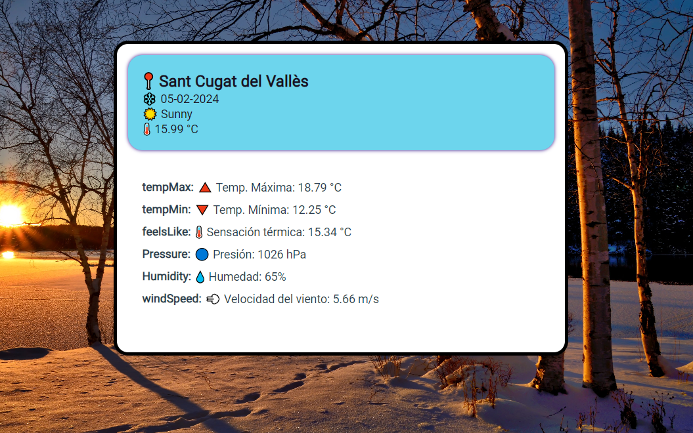

🌦️ **Aplicación del Clima Emoji** 🌈

Esta 🌐 aplicación web está diseñada para ofrecerte toda la información meteorológica 🌡️ que necesitas, pero con un toque divertido y colorido 🎨 gracias al uso de emojis. Al proporcionar datos en tiempo real 🕒 basados en tu ubicación actual 📍, te mantiene informado sobre el clima de una manera que es tanto informativa como visualmente atractiva.

### Características Principales:

- 📍 **Ubicación Automática:** Utiliza tu ubicación actual para mostrarte el clima preciso donde estás.
- 🌞🌦️🌧️ **Descripción del Clima con Emojis:** No solo te dice el estado del clima, sino que también lo acompaña con un emoji relevante para darle vida a la descripción.
- 🌡️ **Temperatura Actual:** Te muestra la temperatura actual junto con un emoji de termómetro para una representación visual inmediata.
- 🥵🥶 **Sensación Térmica:** Informa sobre cómo se siente realmente la temperatura, considerando el viento y la humedad.
- 💧 **Humedad:** Te da el porcentaje de humedad con un emoji de gota de agua para destacar la información.
- 🔵 **Presión Atmosférica:** Proporciona datos de presión con un emoji que ayuda a visualizar este dato atmosférico.
- 🌬️ **Velocidad del Viento:** Muestra la rapidez con la que sopla el viento, representado por un emoji de viento.
- 📅 **Fecha Actual con Emojis:** La fecha se muestra con emojis temáticos según el mes, agregando un toque festivo y contextual.

### Funciones Especiales:

- 🖼️ **Fondo Dinámico:** El fondo de la aplicación cambia según la estación del año, proporcionando un ambiente visual que coincide con el clima exterior.
- 🎥 **GIFs Meteorológicos:** Dependiendo de la temperatura, se muestra un GIF relacionado, añadiendo una capa de interacción y humor.
- 🌅🌞🌆🌙 **Saludos Basados en la Hora del Día:** La aplicación te saluda de manera diferente dependiendo de la hora del día, usando emojis y mensajes personalizados para la mañana, tarde, y noche.

### Cómo Funciona:

1. Al cargar 🔄, la aplicación detecta tu ubicación 🌍 y consulta la API del clima para obtener los datos más recientes.
2. Muestra la información del clima en una interfaz limpia y organizada, donde cada tipo de dato está acompañado por un emoji representativo.
3. La aplicación se actualiza 🔄 cada minuto para garantizar que la información esté siempre al día.

Ya sea que estés planeando tu día 📅, eligiendo tu outfit 🧥, o simplemente curioso sobre el clima, esta aplicación te ofrece una manera única y alegre de obtener la información que necesitas. ¡Prepárate para ver el clima de una forma que nunca imaginaste! 🌟

* <a href = "https://www.flaticon.es/">Iconos y gifs en de FlatIcon</a>