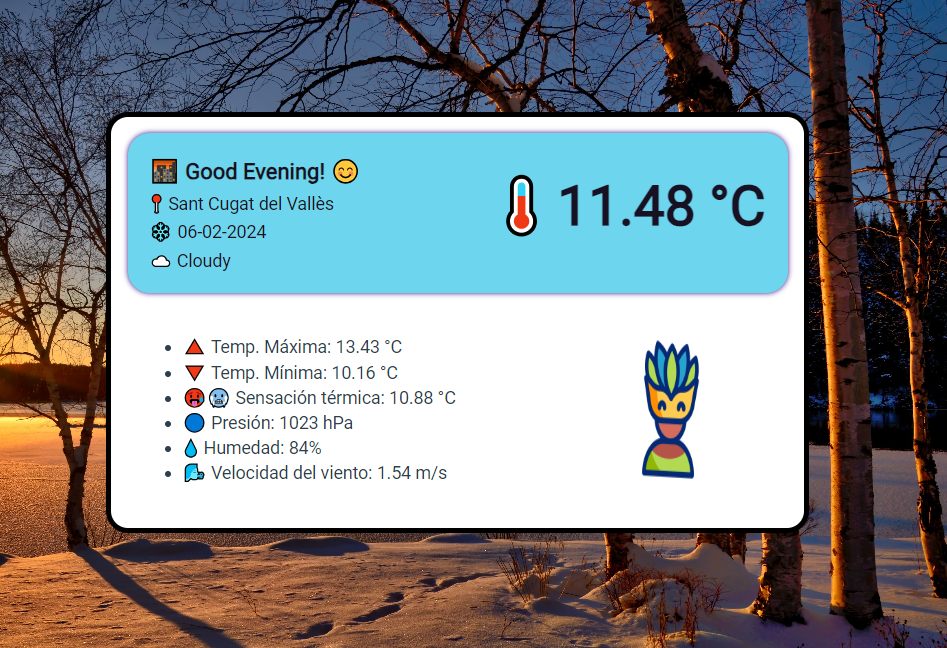

🌦️🌎 **El Clima: Tu Pronóstico Personalizado** 🌞🌧️

¡Descubre el clima en tu ubicación actual de una manera divertida y visualmente atractiva! Con "El Clima", obtén acceso instantáneo a la información meteorológica en tiempo real con solo un clic. 📱💻

Con una interfaz minimalista y amigable, este proyecto te proporciona una experiencia única para conocer el clima en tu área. 🌍

Características principales:
- 📍 Ubicación en tiempo real: Utiliza la geolocalización para obtener datos precisos basados en tu ubicación actual.
- 🌡️ Datos detallados: Conoce la temperatura actual y la sensación térmica, así como la máxima y mínima del día.
- 💧 Humedad y presión: Obtén información sobre la humedad del aire y la presión atmosférica para planificar tus actividades diarias.
- 💨 Velocidad del viento: Conoce la intensidad del viento en tu área y prepárate para cualquier clima.
- 📅 Fecha actual: Mantente al tanto del día y la fecha con un toque de personalización emoji.

Con "El Clima", prepararte para tu día nunca ha sido tan fácil ni tan divertido. ¡Explora el clima con emojis y mantente actualizado con las condiciones meteorológicas en todo momento! 🌈☔

